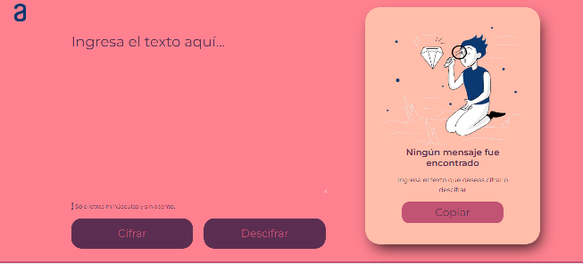
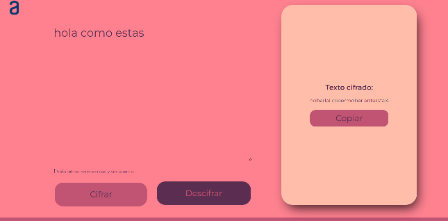

`# Encriptador de Texto`

Este proyecto consiste en una aplicación web simple para cifrar y descifrar texto utilizando un método de sustitución.

## Características:

- Cifrado y descifrado de texto utilizando un conjunto específico de reglas.
- Interfaz amigable para el usuario con validación de entrada.
- Funcionalidad de copiado de texto cifrado o descifrado al portapapeles.

## Tecnologías Utilizadas:

- **HTML:** Estructura básica para la interfaz de usuario y la entrada de texto.
- **CSS (incluyendo Normalize.css):** Estilos para mejorar la apariencia y la consistencia visual en diferentes navegadores.
- **JavaScript:** Manejo dinámico del contenido del texto para cifrar y descifrar según reglas específicas.
Estas tecnologías fueron seleccionadas por su capacidad para proporcionar una interfaz de usuario fluida y funcionalidades de manipulación de DOM en tiempo real.

## Capturas de Pantalla:

*Vista de la interfaz principal del encriptador de texto.*

*Ejemplo del resultado después de cifrar un texto.*

## Instalación y Uso:

1. Clona este repositorio: `git clone` https://github.com/LuissinaMD/Challenge-Encriptador.git
2. Abre index.html en tu navegador web.

## Contribuciones:

Las contribuciones son bienvenidas. Si deseas mejorar este proyecto, por favor sigue estos pasos:

1. Haz un fork del proyecto.
2. Crea una nueva rama (git checkout -b feature/mejora).
3. Realiza tus cambios.
4. Haz commit de tus cambios (git commit -am 'Añade una mejora').
5. Haz push a la rama (git push origin feature/mejora).
6. Abre un Pull Request.

## Autor:

Luissina María Mariño Dansey.

## Año:

2024.
